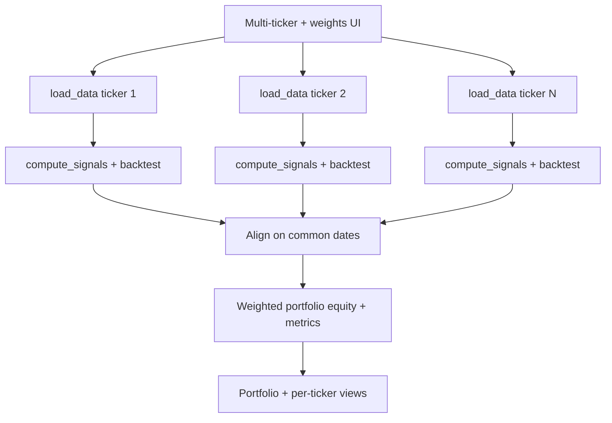

# Trading Strategy Simulator

Interactive Streamlit app to backtest simple trading strategies on stocks.

**Live app:** [trading-strategy-simulator on Streamlit](https://trading-strategy-simulator-hgza3yeln26hpkzqmtmtxq.streamlit.app/)

## Multi-ticker portfolio pipeline

When running multiple tickers with portfolio weights, data is loaded and backtested per ticker in parallel, then merged into a single weighted portfolio view.



## Features

- Ticker input and date range selection
- Strategy picker: Moving Average Crossover, RSI Strategy, Dollar Cost Averaging, Buy & Hold, New Car vs. Investing
- Strategy-specific parameters
- Price chart with buy/sell markers
- Equity curve vs buy-and-hold
- Trades table
- Summary metrics: total return, Sharpe ratio, max drawdown
- English, Traditional Chinese, and Simplified Chinese UI

### New Car vs. Investing

What if you had invested the money for a new car into a stock instead? This strategy simulates:

- Down payment invested immediately (either % of car price or an override amount)
- Recurring payments (weekly / biweekly / monthly) over a chosen term (12–60 months) invested into the stock instead of paying a loan
- Tracks total invested vs current value, gains, number of payments made, and completion status of the payment schedule

If the historical period ends before all scheduled payments, the strategy reports progress so far.

## Project structure

```
PRIVACY.md              # Privacy policy (source for in-app Privacy page)
simulator/
├── app.py              # Streamlit entry point (simulator + navigation)
├── footer.py           # Footer navigation (Privacy / Home)
├── privacy_page.py     # Privacy Policy page content
├── models.py           # Shared data classes (PortfolioResult)
├── data.py             # Data fetching (load_data, calculate_equal_weights)
├── strategies.py       # Signal generation (calc_rsi, compute_signals)
├── backtest.py         # Backtest engine + metrics
├── portfolio.py        # Portfolio orchestration
└── smoke_test.py       # Unit + integration tests
i18n/
├── i18n.py             # Translation helpers (t, set_language, get_lang)
└── locales/            # en.json, zh-TW.json, zh-CN.json
```

## Quick start

1. Create a virtual environment and install dependencies:

```bash
python3 -m venv .venv
source .venv/bin/activate
pip install -r requirements.txt
```

2. Run the app:

```bash
streamlit run simulator/app.py
```

3. Run smoke tests (optional):

```bash
python simulator/smoke_test.py
```

## App navigation

The app uses Streamlit `st.navigation` with two pages:

| Page | Description |
|------|-------------|
| **Simulator** (default) | Main backtest UI |
| **Privacy Policy** | Renders [`PRIVACY.md`](PRIVACY.md) |

Use the **Privacy Policy** link in the page footer to switch pages, and **Back to Simulator** to return. Sidebar navigation is hidden so the main UI stays uncluttered.

## Internationalization (i18n)

Supported languages:

- **English (`en`)** — default
- **繁體中文 (`zh-TW`)**
- **简体中文 (`zh-CN`)**

- Language selector: sidebar on both pages
- Preference is stored in `st.session_state` for the session
- Browser locale is detected once on first visit (falls back to English)

Translation files live in `i18n/locales/*.json`. Use `t("key.path")` in code; see [README_i18n.md](README_i18n.md) for how to add or update keys.

```python
from i18n.i18n import t

st.title(t("app.title"))
st.error(t("errors.fetch_error", ticker="AAPL"))
```

## Privacy Policy

- Source document: [`PRIVACY.md`](PRIVACY.md) at the repository root
- In the app: open **Privacy Policy** from the footer on any page

Update `PRIVACY.md` when your practices or contact details change; the app loads it at runtime.

## Notes

- **Primary data source:** Yahoo Finance via `yfinance`
- **Fallback data source:** Stooq via `pandas-datareader`
- If a ticker is not found, verify symbols at [finance.yahoo.com](https://finance.yahoo.com)
- This is an educational/demo tool, not investment advice
