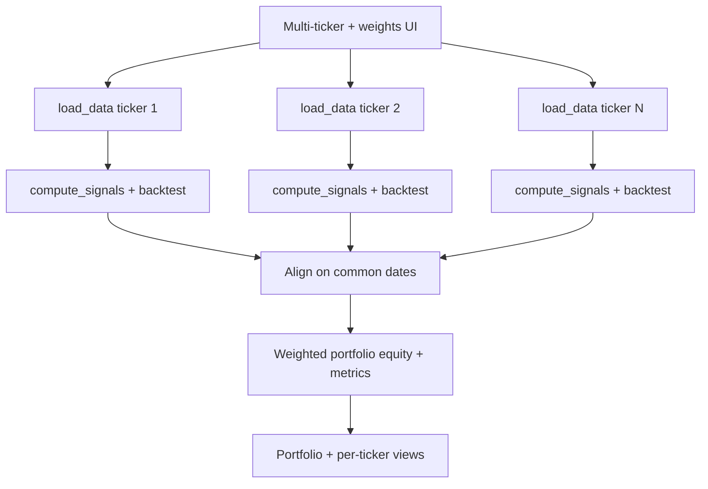

# Trading Strategy Simulator

Interactive Streamlit app to backtest simple trading strategies on stocks.

## Multi-ticker portfolio pipeline

When running multiple tickers with portfolio weights, data is loaded and backtested per ticker in parallel, then merged into a single weighted portfolio view.



## Features
- Ticker input and date range selection
- Strategy picker: Moving Average Crossover, RSI Strategy, Dollar Cost Averaging, Buy & Hold, New Car vs. Investing
- Strategy-specific params
- Price chart with buy/sell markers
- Equity curve vs buy-and-hold
- Trades table
- Summary metrics: Total return, Sharpe, Max drawdown

### New Car vs. Investing
What if you had invested the money for a new car into a stock instead? This strategy simulates:
- Down payment invested immediately (either % of car price or an override amount)
- Recurring payments (weekly / biweekly / monthly) over a chosen term (12–60 months) invested into the stock instead of paying a loan
- Tracks total invested vs current value, gains, number of payments made, and completion status of the payment schedule
If the historical period ends before all scheduled payments, the strategy reports progress so far.

## Project structure

```
simulator/
├── app.py          # Streamlit UI — entry point (main())
├── models.py       # Shared data classes (PortfolioResult)
├── data.py         # Data fetching (load_data, calculate_equal_weights)
├── strategies.py   # Signal generation (calc_rsi, compute_signals)
├── backtest.py     # Backtest engine + metrics (backtest, sharpe_ratio, max_drawdown)
├── portfolio.py    # Portfolio orchestration (run_portfolio_backtest, etc.)
└── smoke_test.py   # Unit + integration tests
i18n/
├── i18n.py         # Translation helpers (t, set_language, get_lang)
└── locales/        # Locale JSON files (en.json, zh-TW.json, zh-CN.json)
```

## Quick start

1. Create a virtual environment and install deps
```bash
python3 -m venv .venv
source .venv/bin/activate
pip install -r requirements.txt
```

2. Run the app
```bash
streamlit run simulator/app.py
```

## Internationalization (i18n)

The app supports multiple languages:
- **English (en)**: Default language
- **繁體中文 (zh-TW)**: Traditional Chinese
- **简体中文 (zh-CN)**: Simplified Chinese

### Language Selection
- Language selector is available in the sidebar
- Language preference is persisted in `st.session_state` across page reloads
- Browser locale detection attempts to set the initial language (defaults to English if detection fails)

### Locale Files
Translation files are stored in `i18n/locales/`:
- `i18n/locales/en.json`: English translations
- `i18n/locales/zh-TW.json`: Traditional Chinese translations
- `i18n/locales/zh-CN.json`: Simplified Chinese translations

### Number and Currency Formatting
The app uses Babel for locale-aware formatting:
- **Currency**: Formatted according to language (USD for English, TWD for zh-TW, CNY for zh-CN)
- **Numbers**: Formatted with appropriate decimal separators and thousand separators
- **Percentages**: Formatted according to locale conventions

### Adding New Translations
1. Add translation keys to all locale YAML files in `locales/`
2. Use the `i18n.t(key, lang)` function in code: `t("app.title", lang)`
3. For formatted strings, pass format arguments: `t("errors.fetch_error", lang, ticker="AAPL")`

### i18n Helper Functions
- `t(key, lang, **kwargs)`: Translate a key with optional format arguments
- `format_currency_localized(amount, lang)`: Format currency using Babel
- `format_number_localized(number, lang, decimal_places=2)`: Format numbers using Babel
- `format_percent_localized(value, lang, decimal_places=2)`: Format percentages using Babel
- `detect_browser_language()`: Detect browser language (defaults to 'en')

## Notes
- Primary Data source: Yahoo Finance via `yfinance`.
- Fallback Data source: Stooq via `pandas-datareader`.
- If ticker is not found, users are directed to verify ticker symbols at finance.yahoo.com
- This is a teaching/demo tool; not investment advice.
